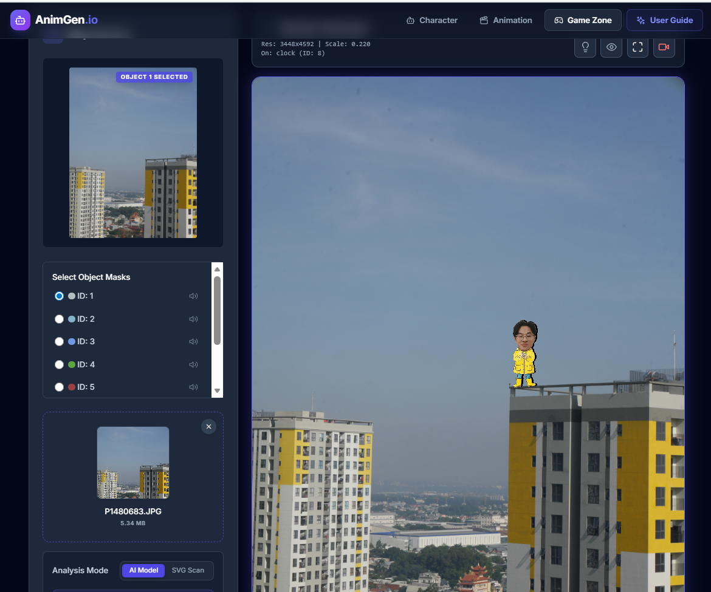
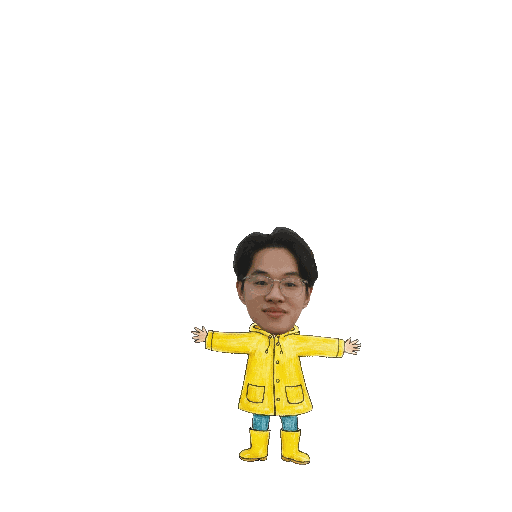

# 🎭 Animate Me

Identity-Preserving Animated Avatar System with Interactive Rendering.

Animate Me is a modular AI system that enables you to:

- Generate cartoon characters from text prompts or input images.
- Preserve user identity traits after stylization.
- Create motion (GIFs) from static images.
- Render characters inside an interactive, game-like environment.

The system is designed with production thinking: clear modularization, easy model replacement, and straightforward scalability.

## 🖼️ Example Results

### 1) Game scene after character compositing



### 2) Sample action output (GIF)



## 🧠 Engineering Highlights

- Multi-stage AI pipeline: generation → segmentation → pose → animation → rendering.
- Clear separation between model layer, orchestration layer, and interface layer.
- FastAPI + WebSocket integration for backend interaction.
- Interactive runtime support with Pygame.

## 🎯 Problem Statement

The goal is to build a digital avatar that can:

- Preserve identity characteristics.
- Generate natural motion from static images.
- Support real-time interaction.

Key challenges:

- **Identity Preservation**: stylization often removes distinctive facial features.
- **Static-to-Dynamic Conversion**: generating smooth motion from a single input frame.
- **Temporal Consistency**: minimizing frame-to-frame flicker.
- **Interactive Rendering**: integrating animation into a runtime environment.

Animate Me addresses the entire pipeline rather than isolated sub-problems.

## 🏗️ System Architecture

```text
Input (Text / Image)
        ↓
Text-to-Image / Upload Handler
        ↓
Style Transfer Module
        ↓
Object Decomposition & Face Segmentation
        ↓
Pose Estimation
        ↓
Motion / Animation Generator
        ↓
GIF Export  |  Interactive Renderer (Pygame)
```

### Layered Design

1. **Model Layer**
   - Text-to-Image
   - Style Transfer
   - Segmentation
   - Pose Estimation
   - Motion Synthesis

2. **Pipeline Layer**
   - Orchestration
   - Action scheduling
   - Frame generation
   - Character state management

3. **Interface Layer**
   - Streamlit demo
   - FastAPI backend
   - WebSocket server
   - Pygame runtime

## ⚙️ Tech Stack

- **Core**: Python 3.8, PyTorch, OpenCV.
- **AI Components**: Text-to-Image, Style Transfer, OpenMMLab/MMPose, Segmentation.
- **Backend/Runtime**: FastAPI, WebSocket, Streamlit, Pygame.
- **Environment**: Conda (recommended), CUDA (optional).

## 🔁 End-to-End Pipeline

1. Receive input from text or image.
2. Generate or normalize the character image.
3. Apply reference style.
4. Decompose foreground/background and segment the face.
5. Estimate poses for each target action.
6. Generate animation frame sequences.
7. Export GIFs or render in an interactive environment.

## 📂 Project Structure

```text
animating_image/
├── src/
│   ├── app/                    # FastAPI backend
│   ├── demo/                   # Streamlit demo
│   ├── pipeline/               # Pipeline orchestration
│   ├── animator/               # Motion synthesis engine
│   ├── pose_estimator/         # Pose estimation
│   ├── image_style_transfer/   # Stylization
│   ├── concept_decomposer/     # Object decomposition
│   ├── face_segmenter/         # Face segmentation
│   ├── img_to_vector/          # Vectorization
│   ├── render/                 # Runtime/game rendering
│   ├── text_to_image/          # Text-to-image
│   ├── text_to_speech/         # TTS
│   ├── configs/                # Character config
│   └── __main__.py
├── external/                   # Third-party models
├── assets/
├── notebook/
├── requirements.txt
└── environment.yaml
```

## 🚀 Installation

### 1) Clone repository

```bash
git clone <your-repo-url>
cd animating_image
```

### 2) Setup environment

**Conda (recommended)**

```bash
conda env create -f environment.yaml
conda activate openmmlab
```

**pip/venv**

```bash
python3 -m venv .venv
source .venv/bin/activate
pip install -U pip
pip install -r requirements.txt
```

### 3) Configure `.env`

```env
GOOGLE_API_KEY=your_google_api_key
POSE_MODEL_CFG_PATH=/absolute/path/to/mmpose_config.py
POSE_MODEL_CKPT_PATH=/absolute/path/to/mmpose_checkpoint.pth

# Optional for API/runtime
STORAGE_ROOT=/absolute/path/to/storage
SERVER_IP=0.0.0.0
SERVER_PORT=8765
TARGET_OBJECT=/absolute/path/to/target_object.json
THIRD_PARTY_WEBSOCKET_URL=ws://host:port
```

## ▶️ Run

### Streamlit demos

```bash
streamlit run src/demo/app.py
```

```bash
streamlit run src/demo/create_animation_demo.py
```

### FastAPI backend

```bash
uvicorn src.app.main:app --reload
```

### Interactive render (Pygame entry)

```bash
python -m src
```

### Utility scripts

```bash
python -m src.test_pipeline
python -m src.test_animation
python -m src.test_pygame
python -m src.test_tts
```

## 📊 Engineering Considerations

### Scalability

- Split the pipeline into independent modules.
- Containerize services when needed.
- Support GPU acceleration.

### Production concerns

- Manage checkpoints/secrets via environment variables.
- Design APIs with stateless principles.
- Expand toward a microservice architecture when needed.

### Optimization

- Reduce actions/frames to improve speed.
- Cache intermediate outputs.
- Batch pose generation when appropriate.

## 🔗 References

- Animated Drawings (Facebook Research): https://github.com/facebookresearch/AnimatedDrawings.git
- Frontend (AnimGen Studio): https://github.com/tamchamchi/animgen-studio.git

## 🛠️ Troubleshooting

- Missing API key or model path: check your `.env` file.
- `src` import errors: run commands from the project root.
- Checkpoint not found: use absolute paths and verify files exist.
- Slow CPU execution: reduce actions/frames or use CUDA GPU.
